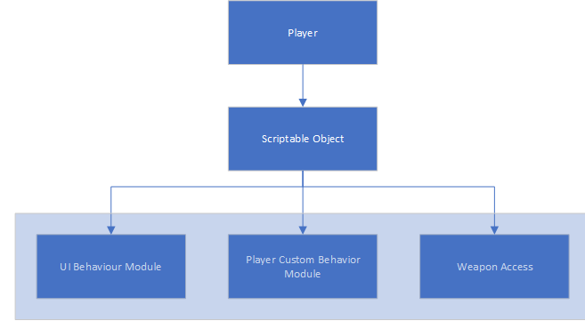
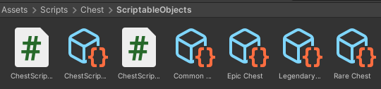

## What are Scriptable objects?

A ScriptableObject is a data container that you can use to save large amounts of data, independent of class instances. One of the main use cases for ScriptableObjects is to reduce your Project’s memory usage by avoiding copies of values. This is useful if your Project has a prefab that stores unchanging data in attached MonoBehaviour scripts.

You can learn more in our Scriptable objects course.

Below is the example of Scriptable Objects created in Unity

Now we will move ahead and see in the next chapter how we can create Scriptable Objects.
