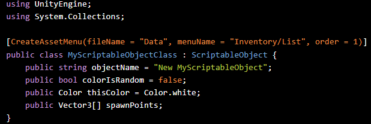

## Creating a Scriptable Object

Let's understand the syntax of the scriptable object,

[**CreateAssetMenu(fileName** = “default filename that player wants to give”, **menuName** = “name that will be shown in asset/createMenu”)] .

**CreateAssetMenu** attribute is used to create custom assets using your class.

- **fileName** - The default file name used by newly created instances of this type.
- **menuName** - The display name for this type is shown in the Assets/Create menu.
- **order** - The position of the menu item within the Assets/Create menu.

**To create a ScriptableObject**,

1. Create a script in your application’s Assets folder
2. Make it inherit from the scriptable object class
3. Use the CreateAssetMenu attribute to make it easy to create custom assets using your class

For example:

 With the above script in your Assets folder, you can create an instance of your ScriptableObject by navigating to Assets > Create > Inventory > List in Unity.
